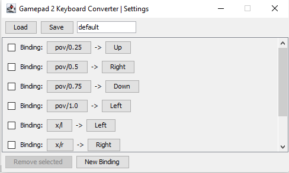

# gamepad 2 keyboard
input converter to allow to play games which don't support gamepads such as old PC games, or online flash/html5 games.

# download
If you have java 17 installed:

- [Download minimalistic (2MB) version](https://github.com/oxcafedead/gamepad2keyboard/releases/download/v0.0.1/gamepad2keyboard-0.0.1-nojava.zip)

If you don't have java 17installed:

- [Download standalone (35MB) version](https://github.com/oxcafedead/gamepad2keyboard/releases/download/v0.0.1/gamepad2keyboard-0.0.1.zip)

# notice
This code was not intended to be public, it's awful and messy, I hope someday I will clean it up. I decided to publish this tool for other people who might want to use their gamepads to play some simple online games as nothing worked for me (from tools I used) - they were too complicated or just did not work.

If you have some issue/idea - feel free to contribute via PRs.
